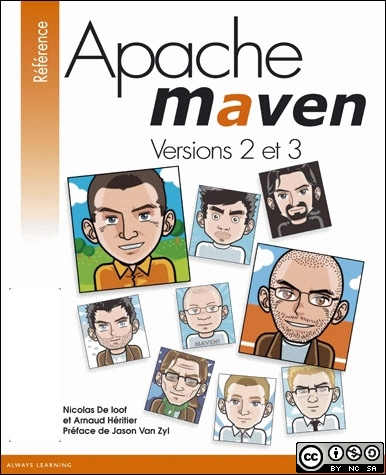

apache-maven-book
=================

Apache Maven (le livre)

Pearson ayant décidé d'arrêter l'exploitation de ce livre, Arnaud et moi-même avons décidé de récupérer nos droits et de le publier pour qu'il soit accessible gratuitement à tous, et - sait-on jamais - vivre un second souffle avec l'aide de contributeurs bénévoles.

License : [Creative-commons CC BY-SA 4.0](http://creativecommons.org/licenses/by-nc-sa/4.0/deed.fr)

Vous pouvez visualiser le contenu [directement sur GitHub](https://github.com/ndeloof/apache-maven-book/blob/master/maven.adoc), ou consulter la [version HTML](https://ndeloof.github.io/apache-maven-book/)

Build
=====

Pour produire les chapitres au format html, utilisez la configuration par défaut d'AsciiDoc

    asciidoc maven.adoc
  
Nous étudions la génération d'un PDF et d'un format ePub.
Un build maven est également à votre disposition si vous y tenez vraiment :)  

Contribuer ?
==============

N'hésitez pas à contribuer ! Si en cours de lecture vous voyez un point à corriger / compléter, utiliser le bouton "edit" de github pour editer le fichier (format asciidoc) et proposer ainsi directement un changement (une pull-request en vocabulaire github).

Si vous voulez contribuer de manière plus active, nous mettons à disposition un script pour éditer les fichiers avec un rendu en temps réel. Il vous faudra Ruby d'installé sur votre poste, puis lancez dans le répertoire du projet :

    gem install bundler
    bundle init
    bundle install
    bundle exec guard

Ouvrez ensuite votre navigateur préféré avec un plugin LiveReload ou équivalent, et vous aurez en temps réel le rendu de vos modifications.

Une autre solution est d'utiliser l'extension AsciiDoctor.js Live Preview pour [Chrome](https://chrome.google.com/webstore/detail/asciidoctorjs-live-previe/iaalpfgpbocpdfblpnhhgllgbdbchmia) ou [FireFox](https://addons.mozilla.org/en-US/firefox/addon/asciidoctorjs-live-preview/). Une fois l'extension installée vous n'avez plus qu'à ouvrir le fichier .adoc localement dans votre navigateur (pour chrome n'oubliez pas d'autoriser l'extension à fonctionner avec les fichiers locaux dans le gestionnaire d'extensions).

Générer d'autres formats ?
==========================

Developpez.com
--------------

Le projet [asciidoc-dvp-mavenbook](https://github.com/mickaelbaron/asciidoc-dvp-mavenbook) fournit un Backend Asciidoc pour générer le livre au format Developpez.com.

Executer l'instructions suivante :

    asciidoc -a revdate=2014-02-20 -d book -f dvp.conf -o book-apachemaven.xml maven.adoc

Cela va construire un fichier _book-apachemaven.xml_ à partir du fichier asciidoc _maven.adoc_. L'attribut _revdate_ permet d'indiquer la date de revision.

Le format Developpez.com impose que l'encodage du contenu soit en ISO-8859-1. L'outil _recode_ sera utilisé pour réaliser cet encodage.

    recode -v -d utf8..latin1 book-apachemaven.xml
