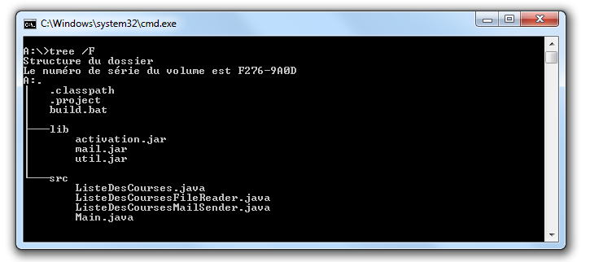
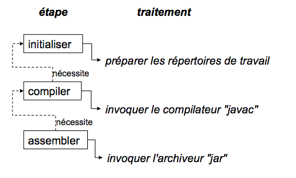

Partie 1 - Premiers pas avec Maven
================================== 

Chapitre 1 : Introduction
========================= 

Commençons donc notre récit par l'inévitable mise en garde : toute
ressemblance avec des personnes ou des situations existantes ou ayant
existé ne serait que fortuite…

Prologue
~~~~~~~~

image:illustrations/MangaNicolas.png[float="left"] image:illustrations/MangaArnaud.png[float="right"]

Nicolas et Arnaud se sont rencontrés au cours d'une conférence organisée
par un Java User Group (si vous ne participez pas à un JUG ... et bien vous avez tort).
Faisant connaissance autour d'un verre, ils
évoquent les souvenirs de leurs premiers pas avec Java, devenu depuis
leur plateforme de prédilection. Un Java Development Kit dans une
version qui fait sourire aujourd'hui, et les bons vieux "Hello World"
qui initient tout développeur à un nouveau langage. De nombreux
souvenirs qui rappellent qu'on a tous débuté un jour, rencontré les
mêmes problèmes et commis les mêmes erreurs idiotes que l'on dénonce
aujourd'hui.

La première application un peu intéressante de Nicolas était un
splendide outil de gestion de sa liste de courses. D'un naturel assez
désorganisé, Nicolas n'a jamais réussi à mémoriser toute la liste. Il
lui est même déjà arrivé de l'oublier ou pire, d'oublier tout simplement
de faire les courses. Son application était donc un extraordinaire
pense-bête, qu'il lançait à l'avance et qui lui envoyait fièrement, dix
minutes avant son départ du bureau, un message de rappel avec la liste
des courses. Autrement dit, un outil de rêve totalement indispensable, à
tel point que le code de ce monument de l'informatique est
respectueusement conservé quelque part.

Arnaud, confronté au même souci et amusé par cette solution de pur geek,
lui demande s'il a toujours son programme et s'il peut en faire une
copie pour satisfaire sa curiosité – la geekitude est dangereusement
contagieuse !

Partageons !
~~~~~~~~~~~~

De retour à la maison, Nicolas fouille dans ses archives et en retire
une vieille disquette (vous savez, ces carrés de plastique qu'on
utilisait "dans le temps", avant que la clé USB et Internet ne les
fassent disparaître). Il envoie donc le trésor tant convoité à Arnaud.

Pour vous faire une meilleure idée de cette exceptionnelle construction
logicielle, voici les fichiers qui la constituent :

La structure originale du projet "noubliepaslalistedescourses".

Arnaud, qui, semble-t-il, n'a vraiment que cela à faire de son temps
libre, se jette sur cette magnifique relique des années Java 1.1 et
tente de le compiler. Seulement, Arnaud est un utilisateur Mac. Le
fichier BAT qui compile et assemble le logiciel en une archive Java JAR
est inexploitable sur son système. Arnaud n'est pas du genre à se
décourager si facilement, aussi écrit-il un fichier de compilation
adapté à son environnement afin de pouvoir tester ce chef-d'œuvre de
l'informatique.

Deux jours plus tard, profitant d'un peu de rangement, Nicolas retrouve
une autre disquette contenant une version plus avancée de son logiciel,
qui utilise les fonctions d'une bibliothèque utilitaire pour lire le
fichier contenant la liste des courses. Il l'envoie donc à Arnaud, qui
une nouvelle fois doit écrire son propre fichier de compilation.

Le "projet" étant trivial, la traduction du build.bat en build.sh est
rapide. Voici pour comparaison les deux fichiers utilisés respectivement
par Nicolas et Arnaud. Les différences sont minimes mais nécessitent une
reprise manuelle à chaque modification, pouvant introduire des
disparités, voire des incompatibilités entre les environnements de nos
deux compères, qui peuvent leur faire perdre un temps précieux.

Listing 1.1 : Les fichiers de compilation utilisés respectivement par
Nicolas et par Arnaud

$$$ 2 colonnes [mangaNicolas] + build.bat   [mangaArnaud] + build.sh $$$

image:illustrations/MangaNicolas.png[float="left"]

	@echo off
	set JAVA_HOME=C:\jdk1.3
	set PATH=%JAVA_HOME%\bin
	set CLASSPATH=lib\mail.jar;lib\activation.jar

	mkdir build
	javac -d build src\*.java
	jar cf noubliepaslalistedescourses.jar build\*.class

image:illustrations/MangaArnaud.png[float="left"]

	#!/bin/bash
	export JAVA_HOME=/opt/jdk1.3
	export PATH=$JAVA_HOME/bin
	export CLASSPATH=lib/mail.jar:lib/activation.jar

	mkdir build
	javac -d build src/*.java
	jar cf noubliepaslalistedescourses.jar build/*.class

De nombreux projets industriels ou communautaires sont confrontés à ce
même problème et sont obligés de maintenir deux versions (ou plus) du
script de construction du logiciel, soit parce que l'équipe n'est pas
homogène, soit parce que l'environnement de test ou de production n'est
pas équivalent à celui de développement. Même sur des systèmes
d'exploitation identiques, les outils peuvent être installés à des
emplacements différents, ce qui oblige à prévoir dans le script un
ensemble de propriétés que chacun devra renseigner en fonction de sa
configuration.

Sur Unix, ce problème a été traité depuis longtemps par l'outil make.
Cependant, celui-ci n'est pas facilement exploitable sur les machines
Windows, omniprésentes comme postes de développement.

Arnaud raconte ses déboires à son collègue Olivier. Ce dernier,
utilisateur du système Solaris, s'est souvent trouvé face à ce
problème ; il lui propose d'utiliser un fichier de commande universel,
basé sur l'outil Apache Ant.

Les fourmis à la rescousse
~~~~~~~~~~~~~~~~~~~~~~~~~~

Qu'est-ce que c'est que ce "Ant" ? Faisons un détour par Wikipédia pour
nous en faire une idée :

Infolink:#_ftn5[*[5]*]

Ant est un projet open-source de la fondation Apache, écrit en Java, qui
vise le développement d'un logiciel d'automatisation des opérations
répétitives tout au long du cycle de développement logiciel, à l'instar
des logiciels Make.

Le nom est un acronyme pour _Another Neat Tool_ (un autre chouette
outil).

Ant est principalement utilisé pour automatiser la construction de
projets en langage Java, mais il peut l'être pour tout autre type
d'automatisation dans n'importe quel langage.

Parmi les tâches les plus courantes, citons la compilation, la
génération de pages HTML de document (Javadoc), la génération de
rapports, l'exécution d'outils annexes (checkstyle, findbugs, etc.),
l'archivage sous forme distribuable (JAR, etc.).

Ant a connu un succès exceptionnel et occupe une place de choix dans la
panoplie de tout développeur. Aucun logiciel dédié à Java ne peut
aujourd'hui se permettre de ne pas fournir des tâches Ant. Le choix de
cette solution semble donc la meilleure marche à suivre !

image:illustrations/MangaOlivier.png[float="left"]

Pour lui faciliter la tâche, Olivier envoie à Arnaud un script Ant,
appelé avec beaucoup d'originalité build.xml, qu'il utilise lui-même sur
la plupart de ses projets, et qui est donc rodé et bourré d'options et
de paramètres indispensables permettant de le plier à tous les besoins
courants.

Aurait-on trouvé avec Ant la solution miracle, rassemblant tous les
suffrages ?

image:illustrations/MangaFabrice.png[float="left"]

Pas si simple : Nicolas, de son côté, désolé d'avoir causé tant de
soucis à Arnaud, a reçu le même conseil de Fabrice, qui lui aussi a
proposé un script de commandes Ant à tout faire, éprouvé par de
nombreuses années d'utilisation. Le fichier d'Olivier suppose que les
fichiers sources java sont stockés dans un répertoire sources et que les
bibliothèques java sont placées sous libraries. Celui de Fabrice fait
des choix différents, respectivement java et libs. De plus, la commande
de compilation pour le fichier d'Olivier est ant package alors que celle
de Fabrice est ant jar. La fusion de ces deux fichiers, chacun apportant
des options intéressantes, est un véritable casse-tête. Rapidement, les
quatre compères, qui commencent à se prendre au sérieux avec leur liste
de courses, font appel à des connaissances spécialistes d'Ant pour les
assister dans cette lourde tâche.

Ant a donc créé un nouveau métier dans le microcosme informatique :
expert en script Ant ! Certains projets semblent jouer pour le concours
du script le plus inutilement tordu, mixant des paramètres à n'en plus
finir (que personne n'a d'ailleurs jamais eu besoin de modifier) et
prenant en charge des cas de figure qui tiennent de l'expression
artistique, le tout en important d'autres fichiers de script pour éviter
l'ignoble copier-coller. S'ils sont fonctionnels, de tels scripts sont
un enfer à maintenir et traduisent une organisation suspecte du projet,
qui pourrait bien avoir laissé passer un élément de complexité inutile.

Pris au jeu, nos quatre amis – qui ont trouvé un boulot en or pour avoir
autant de temps libre – ne s'avouent pas vaincus et veulent poursuivre
ensemble le développement de ce projet. Des complications commencent à
émerger. Notre petite équipe provenant d'horizons différents, chacun a
ses habitudes "maison" et ses bonnes pratiques et voudrait les voir
appliquées.

Et Maven dans tout ça ?
~~~~~~~~~~~~~~~~~~~~~~~

Au hasard d'un de ces appels au secours, Jason les prend à contre-pied
et leur répond : "Et pourquoi ne pas utiliser plutôt Apache Maven ?"
Surpris, et quelque peu incrédules devant cette proposition, ils mettent
Jason au défi de compiler ce fameux logiciel avec son outil miracle, là
où nos deux scripts Ant, pourtant irréprochables, pris séparément
refusent obstinément la fusion. Et dix minutes plus tard, Jason envoie
un fichier de quelques lignes, d'une simplicité surprenante, et les
instructions de base pour installer Maven. À leur grande surprise,
chacun arrive à compiler le projet sur son environnement, quelle que
soit sa singularité.

Voici le fichier envoyé par Jason :

Listing 1.2 : pom.xml

	<project>
	  <modelVersion>4.0.0</modelVersion>
	  <groupId>fr.noubliepaslalistedescourses</groupId>
	  <artifactId>noubliepaslalistedescourses</artifactId>
	  <version>0.0.1-SNAPSHOT</version>
	  <build>
	    <sourceDirectory>src</sourceDirectory>
	  </build>
	  <dependencies>
	    <dependency>
	      <groupId>javax.mail</groupId>
	      <artifactId>mail</artifactId>
	      <version>1.4</version>
	    </dependency>
	    <dependency>
	      <groupId>commons-io</groupId>
	      <artifactId>commons-io</artifactId>
	      <version>1.4</version>
	    </dependency>
	  </dependencies>
	</project>

Comparé aux fichiers Ant testés jusqu'ici, ce fichier "pom.xml" – quel
drôle de nom – ne ressemble à rien de connu. Pas de directive de
compilation, pas d'indication d'ordre dans les tâches, pas de commande
d'assemblage du JAR. Où est le secret ?

Que fait Maven ?
~~~~~~~~~~~~~~~~

Épluchons point par point les consignes de Jason et voyons.

L'installation de Maven à proprement parler se résume à désarchiver un
fichier ZIP et à définir la variable PATH pour y ajouter le chemin vers
le répertoire apache-maven/bin. Il faut aussi s'assurer d'avoir la
variable d'environnement JAVA_HOME qui indique l'emplacement du JDK
(_Java Development Kit_), ce qui est généralement le cas sur le poste de
travail des bons développeurs. La construction du projet s'effectue
ensuite _via_ la commande mvn package depuis la ligne de commande. Rien
de bien révolutionnaire donc par rapport au script Ant que nous avions
envisagé.

Jason nous a indiqué que Maven nécessitait une connexion à Internet.
L'installation n'est donc pas complète, et Maven va rechercher sur le
réseau les éléments manquants. Effectivement, la première exécution de
Maven se traduit dans la console par une série de messages de
téléchargements divers :

Listing 1.3 : Première exécution de Maven

	D:\noubliepaslalistedescourses>mvn package
	[INFO] Scanning for projects...
	[INFO]
	------------------------------------------------------------------------
	[INFO] Building Unnamed - fr.
	noubliepaslalistedescourses:noubliepaslalistedescourses:jar:0.0.1-SNAPSHOT
	[INFO]    task-segment: [package]
	[INFO]
	------------------------------------------------------------------------
	Downloading:
	http://repo1.maven.org/maven2/org/apache/maven/plugins/maven-resources-plugin/2.2/maven-resources-plugin-2.2.pom
	1K downloaded
	Downloading:
	http://repo1.maven.org/maven2/org/apache/maven/plugins/maven-plugins/1/maven-plugins-1.pom
	3K downloaded
	Downloading:
	http://repo1.maven.org/maven2/org/apache/maven/maven-parent/1/maven-parent-1.pom
	6K downloaded
	Downloading:
	http://repo1.maven.org/maven2/org/apache/apache/1/apache-1.pom
	3K downloaded
	...

Cette liste de messages semble même interminable et avoir été conçue
pour favoriser le développement d'Internet à haut débit. Tout ça pour
notre projet composé de trois classes ? Jason nous a prévenus qu'à la
première utilisation, Maven semble télécharger tout Internet, mais il
nous a promis des explications ! Mise en garde quelque peu surprenante,
mais laissons-lui le bénéfice du doute.

Info

La mise en garde de Jason est judicieuse car de nombreux utilisateurs
sont surpris par ce comportement de Maven et sa dépendance à une
connexion Internet. Nous verrons par la suite ce qui impose ce mode de
fonctionnement et en quoi cela sert les utilisateurs plutôt que de les
contraindre.

Poursuivons l'analyse des messages que Maven trace dans la console, en
ignorant les lignes liées à ces téléchargements étranges mais
apparemment nécessaires :

Listing 1.4 : Seconde exécution de Maven… sans téléchargement cette fois

	D:\noubliepaslalistedescourses>mvn package
	[INFO] Scanning for projects...
	[INFO]
	------------------------------------------------------------------------
	[INFO] Building Unnamed -
	fr.maven:noubliepaslalistedescourses:jar:0.0.1-SNAPSHOT
	[INFO]    task-segment: [package]
	[INFO]
	------------------------------------------------------------------------
	[INFO] [resources:resources]
	[INFO] Using default encoding to copy filtered resources.
	[INFO] [compiler:compile]
	[INFO] Compiling 3 source files to
	D:\java\workspace\malistedecourses\target\classes
	[INFO] [resources:testResources]
	[INFO] Using default encoding to copy filtered resources.
	[INFO] [compiler:testCompile]
	[INFO] Nothing to compile - all classes are up to date
	[INFO] [surefire:test]
	[INFO] Surefire report directory:
	D:\java\workspace\malistedecourses\target\surefire-reports

	-------------------------------------------------------
	 T E S T S
	-------------------------------------------------------
	There are no tests to run.

	Results :
	Tests run: 0, Failures: 0, Errors: 0, Skipped: 0

	[INFO] [jar:jar]
	[INFO] Building jar:
	D:\java\workspace\malistedecourses\target\malistedecourses-0.0.1-SNAPSHOT.jar
	[INFO]
	------------------------------------------------------------------------
	[INFO] BUILD SUCCESSFUL
	[INFO]
	------------------------------------------------------------------------
	[INFO] Total time: 15 seconds
	[INFO] Finished at: Fri Jan 02 17:02:09 CET 2009
	[INFO] Final Memory: 6M/13M
	[INFO]
	------------------------------------------------------------------------

Nous constatons que Maven a compilé nos trois fichiers sources et
construit un fichier JAR, ce qu'on attendait de lui, mais il a également
tenté de copier des "ressources" et d'exécuter des tests, ensemble de
traitements que nous n'avons spécifiés nulle part !

La clé du mystère
~~~~~~~~~~~~~~~~~

Interrogé sur le sujet, Jason nous livre la clé du mystère : Ant, make
et bon nombre d'outils similaires s’appuient sur une approche
procédurale, pour laquelle on décrit les opérations à accomplir pour
construire le logiciel ou exécuter des tâches annexes. Cela se traduit
donc par une suite de commandes, qui prendra d'une façon ou d'une autre
la forme décrite à la Figure 2.

Les étapes élémentaires de construction d'un projet.

Cette approche fonctionne très bien et permet de faire à peu près tout
ce qu'on veut, mais elle nécessite :

 * de répéter pour chaque nouveau projet une liste de tâches très
similaires*, ce qui se traduit souvent par la copie d'un fichier de
configuration considéré comme "faisant référence" ;

 * de gérer une liste de dépendances entre les étapes clés*, comme,
dans notre exemple, "compiler" lorsqu'on désire assembler le JAR.

Maven choisit une approche différente, fondée sur le constat suivant :
tous les projets Java vont suivre peu ou prou le même schéma. Les
développeurs de Maven considèrent alors qu'il est plus simple de décrire
en quoi un projet est différent de ce "scénario type" que de répéter
invariablement des commandes très comparables d'un projet à l'autre.
Maven exploite donc le concept très structurant de conventions.

Convention plutôt que configuration
^^^^^^^^^^^^^^^^^^^^^^^^^^^^^^^^^^^

Notre pseudo-exemple réunissant les étapes "initialiser", "compiler",
"assembler" semble s'appliquer à n'importe quel projet informatique,
alors pourquoi devons-nous répéter cette déclaration pour chaque
projet ? C'est exactement la question que soulève Maven et à laquelle il
répond simplement : tout projet Java passe par une phase de préparation,
de compilation puis d'assemblage. Ces trois phases ne sont pas propres à
un projet, mais liées au développement informatique et s'appliquent à
tous.

Maven définit donc un scénario type de construction d'un projet Java,
avec des étapes clés prédéfinies et dont l'ordre est immuable. Ce "cycle
de vie" est suffisamment large et consensuel pour être applicable à
quasiment tous les projets. En admettant que le nôtre n'ait rien de
particulier comparé à tous ceux que pilote Maven, nous comprenons mieux
comment celui-ci a "deviné" les opérations nécessaires à sa
construction.

Java Entreprise Edition suit également cette piste en proposant un
environnement standardisé et un format de livraison commun pour les
applications, même s'il existe de nombreux serveurs d'applications ayant
des caractéristiques très variées. Construire une application web Java
consiste à assembler une archive WAR (_Web Application Archive_), que
l'on ait choisi JBoss, Webpshere, Tomcat ou Jetty pour l'exécuter. Le
comportement "par convention" d'une application web est défini par une
norme, chaque serveur proposant des options de configuration pour
bénéficier d'un comportement personnalisé lorsque c'est nécessaire. Une
convention a, bien sûr, un statut inférieur à une norme comme JavaEE,
mais elle apporte la même simplification.

La force des conventions est d'offrir à ceux qui les suivent un outil
directement exploitable, sans configuration complémentaire. Une
convention de Maven concerne par exemple l'emplacement des fichiers
sources Java à compiler. Notre fichier pom.xml contient effectivement
une indication sourceDirectory que nous faisons pointer sur le
répertoire src. Cette indication n'aurait pas été nécessaire si nous
avions suivi la convention. Il nous suffit de l'adopter pour alléger
d'autant notre configuration Maven.

Nous verrons en détail plus loin les diverses conventions préconisées
par Maven. Certains trouveront cette structure inutilement complexe, peu
pratique, ou au contraire parfaitement adaptée à leurs habitudes.
L'essentiel n'est pas là, mais dans le fait que Maven propose une
organisation par défaut, qui peut fonctionner sans plus d'indications
pour tout projet qui la respecte. La force de Maven est de présenter une
structure conventionnelle, qui évite à chacun un travail rébarbatif de
configuration.

Maven reposant sur un scénario type de construction de projet Java, nous
n'avons plus besoin d'indiquer la moindre commande. Il nous suffit de
décrire en quoi notre projet est différent de ce cas stéréotypé. Nous
passons d'une approche programmatique à une solution déclarative.

Décrire plutôt que programmer
^^^^^^^^^^^^^^^^^^^^^^^^^^^^^

Notre fichier pom.xml de Maven ne compte aucune commande de compilation
et, pourtant, il se traduit au final par l'exécution des outils de
compilation et d'assemblage du JDK. Maven fait le choix d'une approche
déclarative, dans laquelle on indique les particularités du projet et
non la manière de le construire. On précise l'emplacement des fichiers
sources, les bibliothèques qui sont nécessaires, plutôt que la ligne de
commande du compilateur.

La différence est très significative, car il ne s'agit plus de définir
les options de javac, mais de décrire une structure plus générale du
projet, qui pourra être exploitée dans un autre contexte. Elle sera, par
exemple, utilisée pour s'intégrer dans un IDE (_Integrated Development
Environment_) comme Eclipse ou par les outils d'analyse de code.

POM
^^^

Avec ces explications, revenons à présent sur le fichier pom.xml que
Jason nous a écrit.

Tout d'abord, pourquoi ce nom ? Nous avons vu que ce fichier ne décrit
pas la procédure de construction du projet mais qu'il rassemble des
éléments descriptifs. Il est donc logique qu'il ne s'appelle pas
build.xml (en dehors du conflit que cela introduirait avec les
utilisateurs d'Ant).

Les trois lettres POM sont en fait l'acronyme de _Project Object Model_.
Sa représentation XML est traduite par Maven en une structure de données
riche qui représente le modèle du projet. Ces déclarations sont
complétées avec l'ensemble des conventions qui viennent ainsi former un
modèle complet du projet utilisé par Maven pour exécuter des
traitements.

La première partie du POM permet d'identifier le projet lui-même.

Listing 1.5 : L'en-tête du fichier POM

    <modelVersion>4.0.0</modelVersion>
    <groupId>fr.noubliepaslalistedescourses</groupId>
    <artifactId>noubliepaslalistedescourses</artifactId>
    <version>0.0.1-SNAPSHOT</version>

L'élément modelVersion permet de savoir quelle version de la structure
de données "modèle de projet" est représentée dans le fichier XML.
« 4.0.0 » correspond à la version utilisée par Maven 2.x dans toutes ses
variantes.

MAVEN3

Les futures versions de Maven 3 pourront exploiter des versions
différentes de modèles et introduire des évolutions dans le format de ce
fichier. Entre autre, sont envisagés :

  * l’import partiel d’autres fichiers POM (« mixins ») permettant de
construire un projet par agrégation de bonnes pratiques,

  * des mécanismes avancés de gestion de dépendance,

  * et tout ce qui pourra s’avérer utile pour rendre Maven 3.x plus
puissant et encore plus universel !

L'identifiant de groupe (groupId) permet de connaître l'organisation,
l'entreprise, l'entité ou la communauté qui gère le projet. Par
convention, on utilise le nom de domaine Internet inversé, selon la même
logique que celle généralement recommandée pour les noms de package
Java.

L'identifiant de composant (artifactId) est le nom unique du projet au
sein du groupe qui le développe. En pratique et pour éviter des
confusions, il est bon d'avoir un artifactId unique indépendamment de
son groupId.

Enfin, on précise quelle version du projet est considérée. La plupart
des projets utilisent la formule <Version Majeure>.<Version
Mineure>.<Correctif>, même s'il est difficile d'obtenir un consensus sur
la signification exacte de ces numéros et sur leur emploi. Vous pouvez
utiliser une chaîne arbitraire, mais la syntaxe numérique permet de
faire des comparaisons de versions et de trier celles-ci pour identifier
automatiquement la plus récente. SNAPSHOT est un mot clé réservé de
Maven, dont nous décrirons la fonction par la suite.

Astuce

Le numéro de version est un concept délicat et changeant selon les
organisations et la sensibilité de chacun. Nous vous recommandons une
notation purement numérique qui facilite les comparaisons, selon la
logique Majeur.Mineur.Correctif. Seules deux versions majeures peuvent
ne pas assurer de compatibilité, une nouvelle version mineure peut
apporter des fonctionnalités inédites mais s'interdit de ne pas
respecter le mode de fonctionnement existant ; enfin, une version
corrective n'apporte aucune fonctionnalité nouvelle mais élimine
certains problèmes.

Certains enrichissent cette numérotation d'un dernier élément qui
indique le degré de confiance dans une version donnée : "RC" pour une
Release Candidate (version quasi finale), "GA" pour General Availability
pour une version diffusée au public. Cet usage peut porter préjudice au
projet car dans la comparaison purement alphabétique, "GA" est inférieur
à "RC" !

La deuxième partie du POM concerne la construction du projet :

Listing 1.6 : Le bloc build du fichier POM

    <build>
        <sourceDirectory>src</sourceDirectory>
    </build>

L'approche déclarative utilisée par Maven permet de définir
l'emplacement de nos fichiers sources. Le projet étant à la fois très
simple et très banal, aucune autre déclaration n'est nécessaire. Si nous
avions utilisé le répertoire conventionnel de Maven pour les fichiers
sources Java, nous n'aurions même pas eu besoin de ce bloc <build> !

La troisième partie de POM concerne les bibliothèques dont dépend le
projet :

Listing 1.7 : Le bloc dependencies du fichier POM

    <dependencies>
        <dependency>
            <groupId>javax.mail</groupId>
            <artifactId>mail</artifactId>
            <version>1.4</version>
        </dependency>
        <dependency>
            <groupId>commons-io</groupId>
            <artifactId>commons-io</artifactId>
            <version>1.4</version>
        </dependency>
    <dependencies>

Une nouvelle fois, l'approche déclarative prend le dessus : nous
n'indiquons pas l'emplacement physique de ces bibliothèques, à savoir
/lib pour notre projet, mais des identifiants groupId + artifactId +
version. Il s'agit des mêmes identifiants de groupe, de composant et de
version, que nous venons de rencontrer, appliqués à une bibliothèque.
Nous indiquons, par exemple, que nous utilisons l'API standard JavaMail
en version 1.4.

Nous avons ici une réponse partielle à notre question sur la nécessité
d'un accès Internet : Maven va télécharger les bibliothèques indiquées,
à partir d'une source fiable, plutôt que de se contenter des fichiers
JAR présents dans le répertoire /lib et dont la version et l'origine
sont incertaines. L'espace contenant l'ensemble des bibliothèques
téléchargées est un dépôt d'archives local (_local repository_) et
respecte une convention. Nous verrons en détail au Chapitre 2 les
raisons de cette approche et ses avantages.

Pourquoi adopter ces conventions ?
^^^^^^^^^^^^^^^^^^^^^^^^^^^^^^^^^^

Nous venons de le voir, Maven propose un ensemble de conventions qui
permettent d'outiller le projet avec peu de configuration. Il ne nous
interdit cependant pas de choisir nos propres conventions, comme le
répertoire src pour les sources du logiciel.

Dans ce cas, pourquoi adopter les conventions de Maven, alors qu'il
suffit de quelques lignes de déclaration supplémentaires pour "plier"
Maven à nos habitudes ? Hostiles au changement, comme une grande
majorité des êtres humains, nous préférons cette option.

image:illustrations/MangaEmmanuel.png[float="left"]

C'est à ce moment qu'Emmanuel se propose de nous rejoindre, lui aussi à
temps perdu grâce à son boulot en or, pour enrichir notre projet d'un
grand nombre de nouvelles fonctionnalités. Emmanuel est déjà habitué à
Maven et peut donc être rapidement productif et nous aider à le
configurer correctement. Seulement, les choses ne se passent pas aussi
simplement que prévu, car malgré son expérience de l'outil, Emmanuel ne
retrouve pas ses petits : pour ajouter des tests à notre architecture,
il doit créer un nouveau répertoire de sources, indépendant de celles du
projet. Or notre répertoire src n'a qu'un seul niveau et ne permet pas
de différencier le livrable des tests. Il est donc obligé de déclarer
une nouvelle dérogation aux conventions de Maven.

Par ailleurs, même si les différences sont minimes, il est contraint
d'adapter toutes ses petites habitudes à notre structure de répertoire,
qui n'est pas "strictement conforme Maven".

Les conventions de Maven ne sont pas obligatoires, cependant
réfléchissez à deux fois avant de vouloir en imposer d'autres pour votre
projet. D'une part, vous allez vous compliquer inutilement la tâche en
ne profitant pas du comportement par défaut que propose Maven, et chaque
nouvelle option activée pourra se traduire par une nouvelle phase de
configuration. À moins d'être passionnés par l'éditeur XML, peu de
développeurs prennent du plaisir à perdre un temps précieux dans des
fichiers de configuration, Maven ou autres.

Ensuite, pensez à la gestion de vos équipes et à l'intégration de
nouveaux développeurs. Maven offre l'occasion de définir une fois pour
toutes la structure de tous vos projets Java, de manière homogène. Un
développeur pourra passer d'un projet à un autre sans perdre son temps à
apprendre les petites habitudes locales : où sont les fichiers de
configuration ? Dans quel répertoire place-t-on les données de test ?
Tous les projets qui se conforment aux conventions Maven seront
identiques de ce point de vue, et le développeur sera plus rapidement
productif.

Enfin, contrairement à une politique "maison" qui aurait pu établir ce
type de conventions, celles de Maven sont partagées par la majorité des
développeurs qui ont adopté ce logiciel. Tout nouveau membre de votre
équipe qui a déjà travaillé sur un projet Maven trouvera rapidement ses
repères. Maven et ses conventions deviennent au fil des années le
standard _de facto_ dans le monde professionnel Java car un développeur
trouve immédiatement ses marques lorsqu'il aborde un nouveau projet.

La force des conventions de Maven n'est pas dans le nom des répertoires
qui ont été choisis, mais dans le fait qu'il offre à la communauté des
développeurs Java tout entière une base commune.

La force de Maven
~~~~~~~~~~~~~~~~~

Revenons un peu en arrière : le projet initial, que nous pouvons
considérer comme un prototype, était difficilement exportable en dehors
de l'environnement de son créateur. Il nécessitait un script de
compilation à la fois indispensable et sans grande valeur ajoutée, étant
d'une grande banalité.

L'adoption d'Ant aurait pu partiellement résoudre le problème, mais pour
tirer parti de la richesse des outils qui peuvent lui être greffés, il
aurait fallu que tous les scripts Ant adoptent une structure de base
commune. En l'absence d'une convention dans la communauté Ant pour les
éléments principaux qui gouvernent un projet Java, il peut être
extrêmement délicat de réutiliser et de fusionner des éléments provenant
de sources indépendantes. Enfin, tout ce travail aurait été réalisé par
des copier-coller qu'il aurait fallu répéter pour notre prochain projet.

Maven propose de passer à une approche déclarative, dans laquelle nous
considérerons notre projet comme une variation sur un thème commun. Nous
ne nous soucions plus de savoir quelle opération doit suivre quelle
autre lors de la construction du logiciel. Nous déclarons juste les
quelques éléments spécifiques qui font de notre projet quelque chose
d'unique.

En adoptant des conventions, nous réduisons à quelques lignes les
informations que nous devons déclarer pour que le projet soit pris en
charge par Maven. La maintenance et l'ajout de nouvelles tâches au cours
de la construction du projet s'en trouvent simplifiés. Un développeur,
issu d'un contexte très différent mais déjà utilisateur de l'outil, peut
prendre le projet en main sans difficulté particulière.

La combinaison de conventions et d'une approche innovante fondée sur la
description du projet fait de Maven un outil à part, très différent
d'Ant ou de ses équivalents. Au cours des chapitres qui suivent, nous
allons voir en quoi cette approche se généralise à toutes les tâches qui
accompagnent la vie d'un projet.
